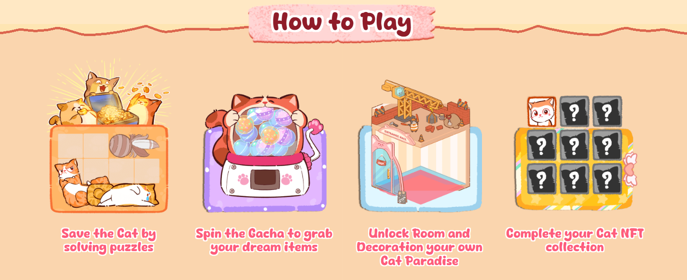
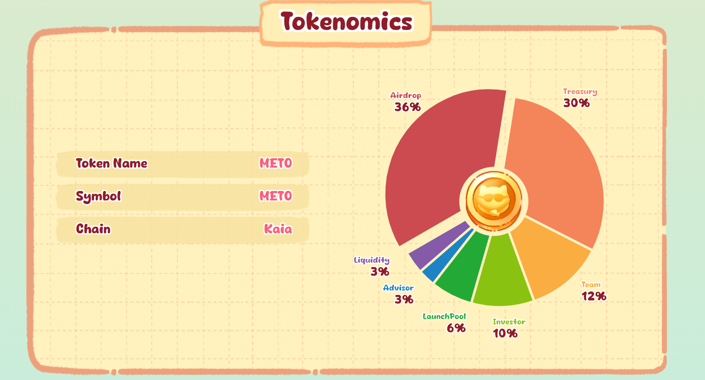
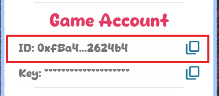

# Meowtopia bot


Meowtopia! Step into a magical world where adorable cats await their hero - you! Rescue rare felines, create cozy homes, and showcase your unique style.

As a pioneering project on Kaia Wave, Meowtopia lets you Rescue Cats, Climb the Leaderboard, and Claim Airdrops. Start your journey today and build the ultimate cat paradise!


- website https://meowtopia.fun/
## Features

- **Auto Checkin**
- **Auto Play puzle game**
- **Auto gatcha**
- **Auto claim mining rewards**
- **Auto build decorations**
- **Support multiple accounts**
- **Support Proxy usage**

## Prerequisites

- Node.js installed on your machine
- `accounts.txt` file containing address from Meowtopia platform follow instruction below to get:
- Open Meowtopia miniApp [https://t.me/Meowtopia_Kaiabot/](https://t.me/Meowtopia_Kaiabot/myapp?startapp=1942365516)

- in game find settings/gear logo  click and copy your id
    


## Installation

1. Clone the repository:
    ```sh
    git clone https://github.com/Zlkcyber/meowBot.git
    cd meowBot
    ```

2. Install the required dependencies:
    ```sh
    npm install
    ```
3. Input your ids in `accounts.txt` file, one user per line;
    ```sh
    nano accounts.txt
    ```
4. optionally you can use proxy: 
- format `http://username:password@ip:port` or `socks5://username:password@ip:port`
    ```sh
    nano proxy.txt
    ```
5. Run the script:
    ```sh
    npm run start
    ```


## 

This project is licensed under the [MIT License](LICENSE).